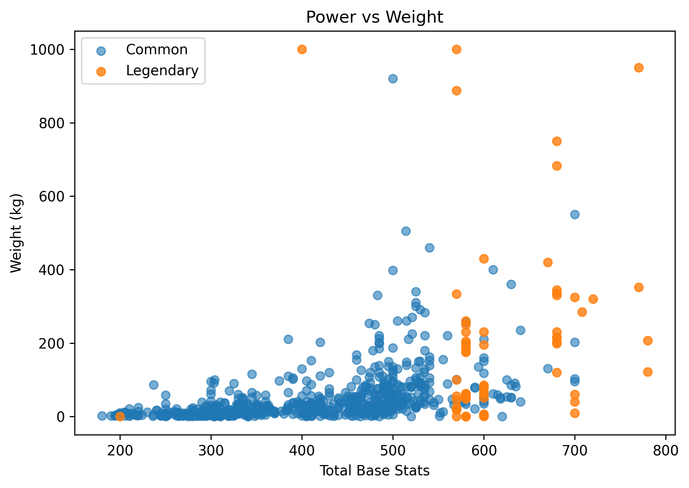

# 🧪 Pokémon Exploratory Data Analysis

An exploratory data analysis project focused on uncovering patterns, trends, and design insights behind Pokémon using statistical analysis and visualization.

Rather than testing strict hypotheses, this project aims to answer intuitive questions anyone might have about Pokémon — and validate (or challenge) those ideas with data.

---

## 🔍 Overview

Using a dataset containing information on all Pokémon across seven generations, this analysis explores how different attributes relate to each other and what they reveal about Pokémon design.

The goal is simple:
**turn common assumptions into data-backed insights.**

---

## 📊 Key Insights

### 1. Stat Archetypes: Physical vs Special


One of the most interesting findings is the clear separation between **physical** and **special** stat distributions.

Pokémon tend to be designed around two main archetypes:

* Physical-oriented (HP, Attack, Defense)
* Special-oriented (Sp. Attack, Sp. Defense)

This reveals a strong underlying structure in how Pokémon are balanced.

---

### 2. Legendary vs Common Pokémon


As expected, legendary Pokémon outperform common ones on average — but not by an overwhelming margin.

Interestingly:

* There are weaker legendary outliers
* The gap is noticeable, but not extreme

This suggests balance considerations rather than pure power inflation.

---

### 3. Power vs Weight



Heavier Pokémon tend to be stronger — but not always.

The key insight:

* There are **almost no heavy weak Pokémon**
* But strong Pokémon can exist across a wide weight range

This asymmetry is subtle but meaningful in understanding design choices.

---

## 🧠 Questions Explored

* Which Pokémon types are predominant?
* Have Pokémon become stronger across generations?
* Are heavier Pokémon more powerful?
* Which is the "best" Pokémon?
* Are harder-to-capture Pokémon stronger?
* How do different stats relate to each other?

---

## 🛠️ Tech Stack

* Python
* pandas
* numpy
* matplotlib
* seaborn

---

## 📁 Project Structure

```
.
├── data/
├── notebooks/
│   └── Pokemon_EDA.ipynb
├── images/
├── requirements.txt
└── README.md
```

---

## 🚀 Getting Started

Clone the repository:

```
git clone https://github.com/<your-username>/Pokemon-Exploratory-Data-Analysis.git
cd Pokemon-Exploratory-Data-Analysis
```

Install dependencies:

```
pip install -r requirements.txt
```

Run the notebook:

```
notebooks/Pokemon_EDA.ipynb
```

---

## 📌 Notes

* The dataset used comes from Kaggle and includes detailed information on Pokémon stats, types, and attributes.
* All analysis is exploratory and focused on uncovering patterns rather than building predictive models.

---

## 👀 Explore the Full Analysis

The complete analysis, including all visualizations and explanations, is available in the notebook:

👉 **[Open the notebook](notebooks/Pokemon_EDA.ipynb)**

---
